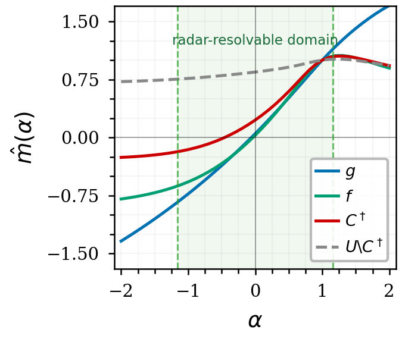
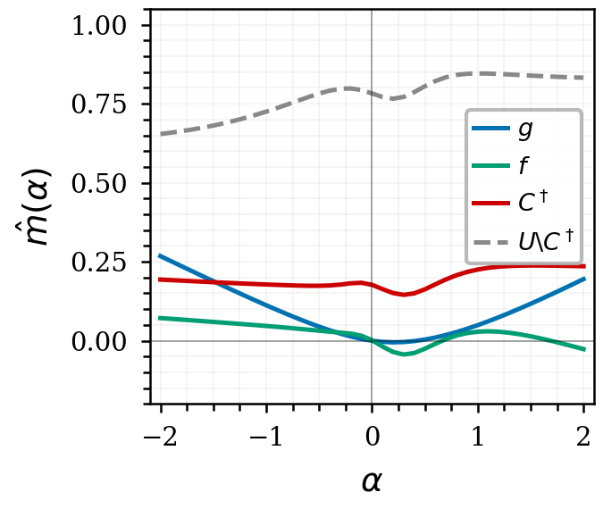
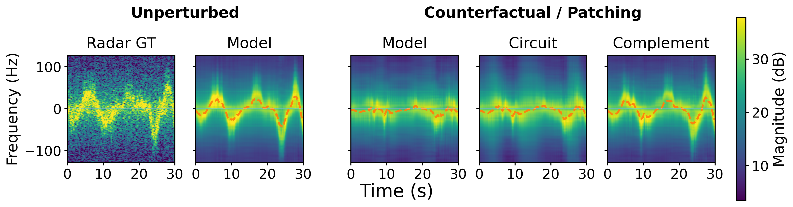

# Doppler Law Simulator in MoCap-to-Radar — reproduction code

## Setup

```bash
pip install torch numpy scipy pandas scikit-learn pyyaml tqdm huggingface_hub   # tested: python 3.10, torch 2.9.0
```

Data (public dataset, pinned revision) and preprocessing:

```bash
python -c "from huggingface_hub import snapshot_download; snapshot_download('ACICULA/mocap2radar', repo_type='dataset', revision='9ff81180fab91238a0125d6e0befe749b52337a1', local_dir='data')"
python scripts/preprocess.py        # data/raw/v3 -> data/processed
```

The checkpoint of the ST(Flat) model (`BaselineMeanPoolAgg` in `src/model/models.py`) is in `models/`
(`baseline_mean_pool_agg.pt`, `model_params.json`, `SHA256SUMS`).

## Doppler consistency score

Consistency score $M_{\mathcal P}(f, g)$ of the unpatched model on RandomWalk1 (2416 windows), radial scaling
$\alpha \in [-1.16, 1.16]$, step 0.01, $\alpha = 1$ excluded (232 values), physics-model reference:

```bash
python scripts/dcs/compute_m0.py --alpha-range -1.16 1.16 0.01 --spec paper=-1.16:1.16:0.01~1 --out results/dcs
```

| | paper | this repo |
|---|---|---|
| $M_{\mathcal P}(f, g)$ | 0.986 | 0.986168 (`results/dcs/paper.json`, `consistency_score`) |

About 30 min on one GPU.

## Circuit $C^\dagger$ = T:{MLP, h1, h2, h6, h7}, S:{MLP}

In code names: `mlp_t h_t_1 h_t_2 h_t_6 h_t_7 mlp_s`. Patching is done on the fly (no activation cache).

```bash
C="--components mlp_t h_t_1 h_t_2 h_t_6 h_t_7 mlp_s"

# f, C†, U\C† under radial and tangential-pure scaling, alpha in [-2, 2] step 0.1 (~20 min on 8 GPUs)
python scripts/dov/compute_phys.py --out results/dov
python scripts/dov/run_sweep.py $C --n-gpus 8 --out results/dov

# consistency score under C† and U\C†, alpha {0, 0.1, ..., 0.9, 1.1}
python scripts/dcs/circuit_score.py --sweep results/dov/sweep.json --phys results/dov/phys.json

# figures
python scripts/dov/plot_main.py --mode radial --sweep results/dov/sweep.json --phys results/dov/phys.json --resolvable 1.16 --out results/dov/radial_main
python scripts/dov/plot_main.py --mode tangential_pure --sweep results/dov/sweep.json --phys results/dov/phys.json --resolvable 0 --out results/dov/tangential_pure_main
python scripts/circuit/dump_spectrograms.py --name cdagger $C --alphas 0.3
python scripts/circuit/plot_spectrograms.py --name cdagger --alpha 0.3
```

| | paper | this repo (`results/dcs/circuit_score.json`) |
|---|---|---|
| $\rho_{C^\dagger}$ | 0.901 | 0.9009 |
| $\rho_{U \setminus C^\dagger}$ | $-1.232$ | $-1.2321$ |

Radial (left) and tangential-pure (right) scaling:

<p>


</p>

Spectrograms at $\alpha = 0.3$, first 30 s:



## Physical-variable accessibility and targeted erasure

Held-out decoding $R^2$ at a location of $C^\dagger$, and $M_{\mathcal P}$ (alpha 0.1..0.9, ideal law) after
LEACE erasure of the variable there, against three rank-matched random erasers. Erasers are fitted on RandomWalk2.

```bash
python scripts/erasure/run_erase.py --site smlp  --target range --out results/erasure    # S:{MLP}, r
python scripts/erasure/run_erase.py --site smlp  --target v_rad --out results/erasure    # S:{MLP}, v_rad
python scripts/erasure/run_erase.py --site heads --target range --out results/erasure    # T:{h1, h2, h6, h7}, r
python scripts/erasure/run_erase.py --site heads --target v_rad --out results/erasure    # T:{h1, h2, h6, h7}, v_rad
```

About 30 min each on one GPU. Paper values, reproduced exactly by `results/erasure/*.csv`
(random control = mean of the three `erase_random*` rows):

| Location | Variable | Decoding $R^2$ | $M_{\mathcal P}$, targeted erasure | $M_{\mathcal P}$, random control |
|---|---|---|---|---|
| S:{MLP} | $r$ | 0.9698 | 0.9883 | 0.9885 |
| S:{MLP} | $v^{\mathrm{rad}}$ | 0.0005 | 0.9209 | 0.9891 |
| T:{h1, h2, h6, h7} | $r$ | 0.9781 | 0.9028 | 0.9885 |
| T:{h1, h2, h6, h7} | $v^{\mathrm{rad}}$ | 0.7344 | $-0.4635$ | 0.9920 |
